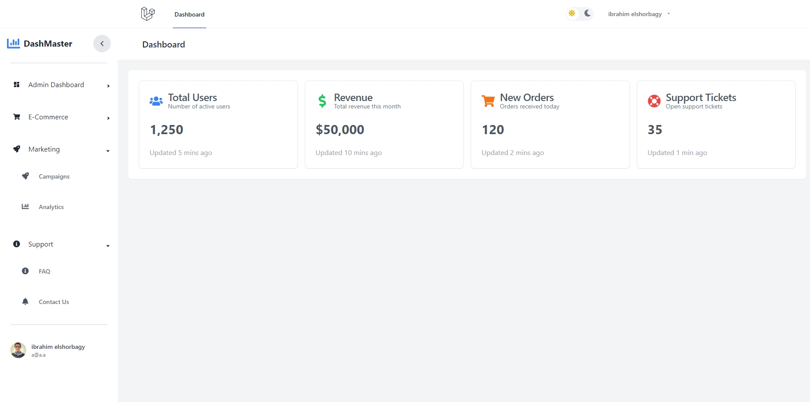
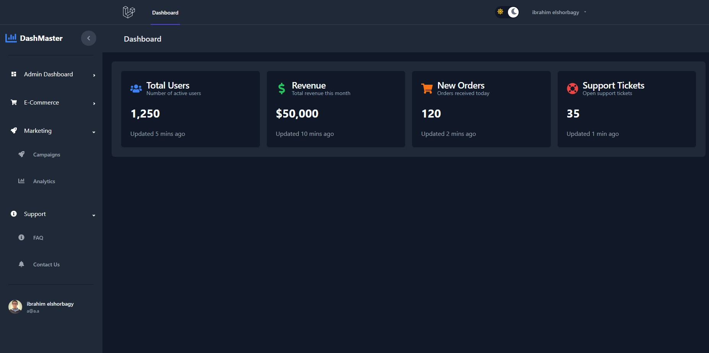
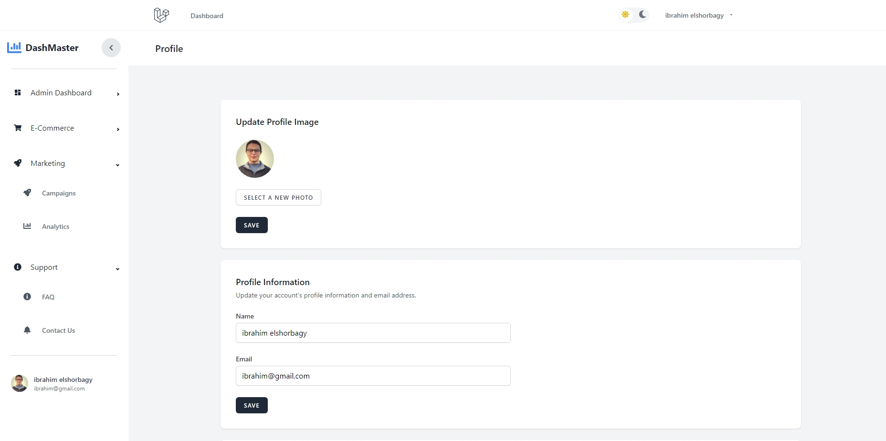
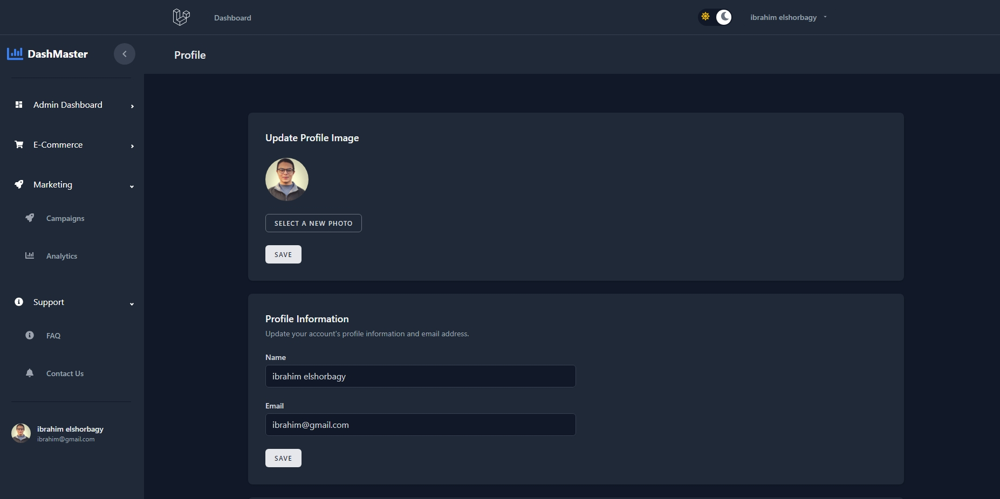

# Laravel-Reactjs-Inertiajs-Dashboard

## Overview

## Technologies Used
- **Backend**: Laravel 11
- **Frontend**: React with Inertia.js
- **Database**: MySQL

## Features
- Dashboard
- Toggle Light or Dark them
- Login
- Logout
- Register
- Reset Password
- Forgot Password
- Profile

